# Which Skill Should I Use?

Decision tree to help select the right skill for any academic writing task.

```mermaid
flowchart TD
    START([What do you need help with?]) --> Q1{Do you need to\ncite sources?}

    Q1 -->|Yes| Q2{Are you formatting\na citation or\nreference list?}
    Q1 -->|No| Q3{Are you writing\nor improving text?}

    Q2 -->|Yes| CF[citation-formatter\nAPA, MLA, Chicago,\nIEEE, Vancouver, etc.]
    Q2 -->|No| Q4{Are you borrowing\nor paraphrasing\na source?}

    Q4 -->|Yes| PE[paraphrasing-engine\nAvoid plagiarism,\nintegrate evidence]
    Q4 -->|No| Q5{Are you reviewing\nmultiple sources?}

    Q5 -->|Yes| LR[literature-review\nSynthesis, PRISMA,\nresearch gap]
    Q5 -->|No| CF

    Q3 -->|Writing new content| Q6{What type of\ndocument?}
    Q3 -->|Improving existing text| Q7{What aspect?}

    Q6 --> D1{Research paper\nor essay?}
    Q6 --> D2{Abstract?}
    Q6 --> D3{Grant proposal?}
    Q6 --> D4{Lab report?}
    Q6 --> D5{PhD/ethics\nproposal?}
    Q6 --> D6{Peer review\nresponse?}
    Q6 --> D10{Thesis or\ndissertation?}
    Q6 --> D11{Cover letter\nfor journal?}
    Q6 --> D12{Qualitative\nresearch?}
    Q6 --> D13{Preregistration?}
    Q6 --> D14{Conference\nposter or talk?}
    Q6 --> D15{Academic CV\nor job app?}

    D1 -->|Need structure| PS[paper-structure\nIMRaD, essays,\ndissertations]
    D1 -->|Need argument| AE[argumentation-engine\nToulmin, Rogerian,\nthesis building]
    D2 --> AW[abstract-writer\nInformational,\nstructured, 5-move]
    D3 --> GP[grant-proposal\nNIH, NSF, EU Horizon,\nSpecific Aims]
    D4 --> LAB[lab-report\nTitle through\nDiscussion]
    D5 --> RP[research-proposal\nPhD, IRB, ethics,\ntheoretical framework]
    D6 --> PRR[peer-review-response\nRebuttal letter,\npoint-by-point]
    D10 --> TDG[thesis-dissertation-guide\nChapter structure,\nviva preparation]
    D11 --> CLW[cover-letter-writer\nJournal submission,\npresubmission inquiry]
    D12 --> QR[qualitative-reporting\nCOREQ, SRQR,\ntrustworthiness]
    D13 --> PRG[preregistration-guide\nOSF, AsPredicted,\nRegistered Reports]
    D14 --> CP[conference-presentation\nPosters, slides,\nconference abstracts]
    D15 --> ACV[academic-cv\nCV, research statement,\nteaching philosophy]

    Q7 --> E1{Grammar,\nclarity, tense?}
    Q7 --> E2{Vocabulary,\nhedging, tone?}
    Q7 --> E3{AI ethics\nor disclosure?}
    Q7 --> E4{Statistics\nor results?}
    Q7 --> E5{Figures\nor tables?}
    Q7 --> E6{References\nor citations?}
    Q7 --> E8{Lay summary\nor public outreach?}

    E1 --> GSC[grammar-style-checker\nVoice, tense,\nparallelism]
    E2 --> ALT[academic-language-toolkit\nAWL, reporting verbs,\ntransitions]
    E3 --> AAE[ai-academic-ethics\nDisclosure, citation\nof AI, policy]
    E4 --> STAT[statistical-reporting\nAPA stats, effect sizes,\nBayesian, CONSORT]
    E5 --> FTC[figure-table-checker\nCompliance, error bars,\ncolor, PRISMA]
    E6 --> RV[reference-verifier\nDOI check, retractions,\nAI hallucinations]
    E8 --> PLS[plain-language-summary\nLay summaries,\npatient summaries]

    Q6 --> D7{LaTeX\ndocument?}
    Q6 --> D8{Journal\nsubmission?}
    Q6 --> D9{Data mgmt\nplan?}

    D7 --> LTX[latex-writer\nDocument classes,\npackages, BibLaTeX]
    D8 --> JS[journal-selection\nMetrics, OA, predatory\ndetection, scope fit]
    D9 --> DMP[data-management-plan\nNIH, NSF, UKRI,\nFAIR, repositories]

    classDef skill fill:#4a90d9,stroke:#2c5f8a,color:#fff
    class CF,PE,LR,PS,AE,AW,GP,LAB,RP,PRR,GSC,ALT,AAE,STAT,FTC,RV,LTX,JS,DMP,TDG,CLW,QR,PLS,PRG,CP,ACV skill
```

## Quick Reference Table

| Your task | Use this skill |
|---|---|
| Write or improve any academic text | `academic-writing-core` (entry point) |
| Format a citation in APA, MLA, Chicago, IEEE... | `citation-formatter` |
| Paraphrase a source / avoid plagiarism | `paraphrasing-engine` |
| Write or improve a literature review | `literature-review` |
| Structure a paper, essay, or dissertation | `paper-structure` |
| Build or evaluate an academic argument | `argumentation-engine` |
| Write or improve an abstract | `abstract-writer` |
| Make text more academic / add hedging | `academic-language-toolkit` |
| Fix grammar, tense, style, wordiness | `grammar-style-checker` |
| Write a grant proposal (NIH, NSF, EU...) | `grant-proposal` |
| Write a research or PhD proposal | `research-proposal` |
| Write a lab report | `lab-report` |
| Respond to peer reviewers | `peer-review-response` |
| Disclose AI use / understand AI policy | `ai-academic-ethics` |
| Report statistics (APA, effect sizes, Bayesian) | `statistical-reporting` |
| Write or compile a LaTeX document | `latex-writer` |
| Check figure or table compliance | `figure-table-checker` |
| Choose a journal / detect predatory journals | `journal-selection` |
| Verify reference accuracy / check for retractions | `reference-verifier` |
| Write a data management plan (NIH, NSF, UKRI, EU) | `data-management-plan` |
| Write a journal submission cover letter | `cover-letter-writer` |
| Report qualitative research (COREQ, SRQR) | `qualitative-reporting` |
| Structure a thesis or dissertation | `thesis-dissertation-guide` |
| Write a lay summary or plain-language abstract | `plain-language-summary` |
| Preregister a study (OSF, AsPredicted, PROSPERO) | `preregistration-guide` |
| Design a conference poster or presentation | `conference-presentation` |
| Write an academic CV or job application materials | `academic-cv` |