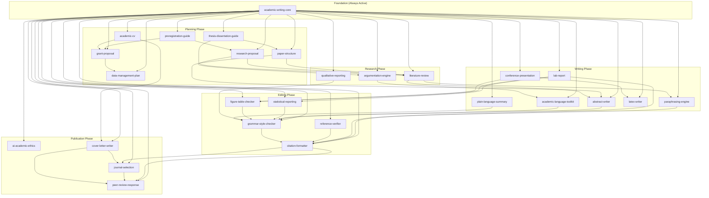

# Skill Map

> **Path note (v1.4.0):** All skill files are now located at `skills/*/SKILL.md` (e.g., `skills/abstract-writer/SKILL.md`). The previous path `1.0.0/skills/*/SKILL.md` is no longer used. Plugin manifests and all documentation have been updated to reflect this structure.

Full relationship diagram of all 27 academic-writer skills, grouped by phase.

