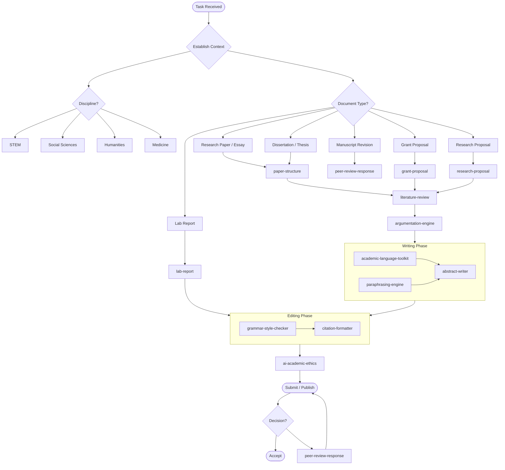

# Academic Writing Lifecycle Workflow

End-to-end workflow showing how the skills map to the writing process.

```mermaid
flowchart TD
    START([Task Received]) --> CONTEXT{Establish Context}

    CONTEXT --> DISC{Discipline?}
    DISC --> STEM[STEM]
    DISC --> SS[Social Sciences]
    DISC --> HUM[Humanities]
    DISC --> MED[Medicine]

    CONTEXT --> TYPE{Document Type?}
    TYPE --> PAPER[Research Paper / Essay]
    TYPE --> DISS[Dissertation / Thesis]
    TYPE --> GRANT[Grant Proposal]
    TYPE --> LABREP[Lab Report]
    TYPE --> REVISE[Manuscript Revision]
    TYPE --> PROP[Research Proposal]

    PAPER --> PLAN1[paper-structure]
    DISS --> PLAN1
    GRANT --> PLAN2[grant-proposal]
    LABREP --> PLAN3[lab-report]
    REVISE --> PLAN4[peer-review-response]
    PROP --> PLAN5[research-proposal]

    PLAN1 --> RESEARCH[literature-review]
    PLAN2 --> RESEARCH
    PLAN5 --> RESEARCH

    RESEARCH --> ARGUE[argumentation-engine]
    ARGUE --> WRITE

    subgraph WRITE[Writing Phase]
        W1[academic-language-toolkit]
        W2[abstract-writer]
        W3[paraphrasing-engine]
        W1 --> W2
        W3 --> W2
    end

    PLAN3 --> EDIT
    WRITE --> EDIT

    subgraph EDIT[Editing Phase]
        E1[grammar-style-checker]
        E2[citation-formatter]
        E1 --> E2
    end

    EDIT --> ETHICS[ai-academic-ethics]
    ETHICS --> SUBMIT([Submit / Publish])
    SUBMIT --> REVIEW{Decision?}
    REVIEW --> ACCEPT([Accept])
    REVIEW --> REVISIONS[peer-review-response]
    REVISIONS --> SUBMIT
```
